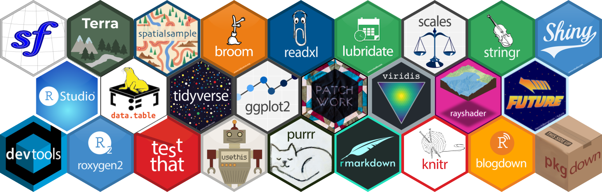

Hello there 👋

I'm a movement ecologist at the [NIOZ Royal Netherlands Institute for Sea Research](https://www.nioz.nl/en]). At the moment I'm analyzing high-resolution shorebird movement data collected with the [WATALS system](https://www.nioz.nl/en/about/cos/coastal-movement-ecology/shorebird-tracking/watlas-tracking-regional-movements). I'm enthusiastic about advancing ecology through collaborative, transparent, and reproducible research.

<!--
**krietsch/krietsch** is a ✨ _special_ ✨ repository because its `README.md` (this file) appears on your GitHub profile.

Here are some ideas to get you started:

- 🔭 I’m currently working on ...
- 🌱 I’m currently learning ...
- 👯 I’m looking to collaborate on ...
- 🤔 I’m looking for help with ...
- 💬 Ask me about ...
- 📫 How to reach me: ...
- 😄 Pronouns: ...
- ⚡ Fun fact: ...
-->
